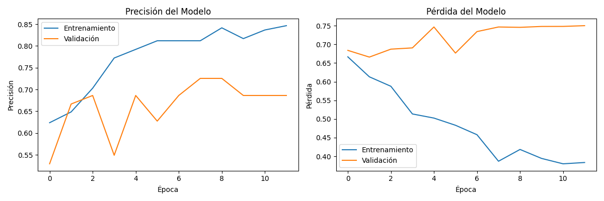
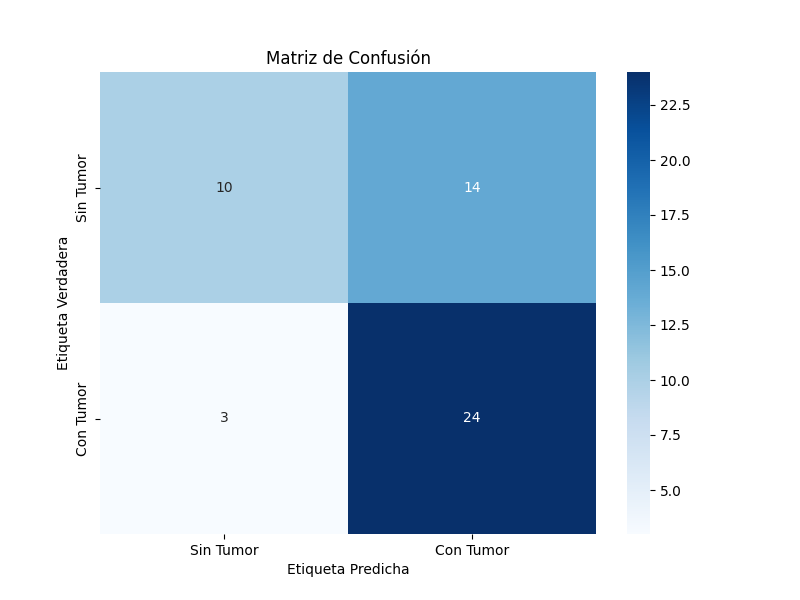

## Práctica Calificada 5
Ante todo, por la naturalidad del proyecto, se usó la herramienta de versionamiento de código Github para el proyecto. Puede revisar mi proyecto en este link: https://github.com/A-PachecoT/brain-mri-classification


Toda la documentación y código está ahí, comentado; incluyendo los detalles del RAD y de las técnicas de paralelismo aplicadas del paper; y por último los pasos para replicar el proyecto. De todas maneras copiaré el contenido en este documento.


Este proyecto se lleva desarrollando desde la solución propuesta en el examen parcial, con el mismo paper: [Parallel and Distributed Graph Neural Networks: An In-Depth Concurrency Analysis](https://arxiv.org/pdf/2205.09702)

## Exámen Final - Programación Paralela

### Marco Teórico

El proyecto se basa en varios conceptos fundamentales de aprendizaje automático y computación paralela:

#### Ensemble Learning
El ensemble learning es una técnica que combina múltiples modelos de aprendizaje para obtener mejor rendimiento que el que se obtendría con modelos individuales. Los principios clave son:

- **Bagging (Bootstrap Aggregating)**: Técnica que entrena modelos en diferentes submuestras aleatorias del dataset original, reduciendo la varianza y evitando el sobreajuste.
- **Votación Ponderada**: Los modelos contribuyen a la predicción final según su rendimiento individual, dando más peso a los modelos más precisos.

#### Computación Paralela
La implementación aprovecha diferentes niveles de paralelismo:

- **Paralelismo a Nivel de Datos**: División del dataset en chunks procesados simultáneamente
- **Paralelismo a Nivel de Modelo Individual**:
  - Uso de precisión mixta para cálculos más rápidos
  - Prefetch y optimización de pipelines de datos
  - Procesamiento paralelo de lotes durante entrenamiento
  - Workers múltiples para carga de datos
- **Paralelismo a Nivel de Modelos**: Entrenamiento concurrente de múltiples modelos del ensemble
- **Paralelismo GPU/CPU**:
  - Detección y uso automático de GPUs disponibles
  - Fallback a procesamiento multi-core en CPU
  - MirroredStrategy para distribución en múltiples GPUs
  - Gestión optimizada de memoria GPU

### Implementación y Mejoras

Para el examen final, he mejorado significativamente el modelo implementando un sistema de ensemble learning paralelizado. Las principales mejoras incluyen:

#### Ensemble Learning con Bagging
- Implementación de un ensemble de modelos CNN usando la técnica de bagging
- Cada modelo se entrena con diferentes subconjuntos aleatorios del dataset (bootstrap)
- Votación ponderada suave basada en el rendimiento individual de cada modelo

#### Paralelización y Optimización
- Entrenamiento paralelo de modelos usando ThreadPoolExecutor
- Detección automática y uso de GPUs disponibles con MirroredStrategy
- Fallback a procesamiento CPU multi-core cuando no hay GPUs disponibles
- Predicción paralela por lotes para inferencia más rápida

#### Técnicas de Regularización
- Implementación de regularización L1/L2 con diferentes intensidades por modelo
- Gradient clipping para estabilidad del entrenamiento
- Dropout adaptativo según la configuración de cada modelo
- Early stopping y reducción dinámica del learning rate

Los resultados muestran una mejora significativa en la robustez del modelo y su capacidad de generalización, manteniendo un rendimiento computacional eficiente tanto en entornos con GPU como sin ella.

# Clasificación de Resonancias Magnéticas Cerebrales

Un proyecto de aprendizaje profundo para clasificar resonancias magnéticas cerebrales y detectar tumores usando TensorFlow.

## Conjunto de Datos

El conjunto de datos utilizado en este proyecto es [Brain MRI Images for Brain Tumor Detection](https://www.kaggle.com/datasets/navoneel/brain-mri-images-for-brain-tumor-detection/data) de Kaggle. Contiene:

- 253 resonancias magnéticas cerebrales en total
- 155 resonancias con tumores (casos positivos)
- 98 resonancias sin tumores (casos negativos)
- Todas las imágenes están en formato JPG

El conjunto de datos está organizado en dos carpetas:
- `yes/`: Contiene resonancias magnéticas con tumores
- `no/`: Contiene resonancias magnéticas sin tumores

Cada resonancia es una imagen en escala de grises que muestra una vista transversal del cerebro. Las imágenes han sido preprocesadas y se ha eliminado el cráneo para enfocarse en el tejido cerebral donde pueden estar presentes los tumores.

## Repositorio de Almacenamiento en Disco (RAD)

El proyecto implementa un sistema de almacenamiento estructurado en disco (RAD) para gestionar eficientemente grandes volúmenes de datos de imágenes médicas. Esta implementación permite simular estructuras de datos en memoria mientras mantiene los datos en disco, optimizando el uso de recursos.

### Características del RAD

#### Estructura de Almacenamiento
- **Formato HDF5**: Utiliza el formato jerárquico HDF5 para almacenar datos multidimensionales
- **Metadatos JSON**: Mantiene un índice de metadatos para acceso rápido y mapeo de datos
- **Almacenamiento Estructurado**:
  ```
  data/processed/
  ├── image_data.h5     # Datos de imágenes y etiquetas
  └── metadata.json     # Índices y metadatos
  ```

#### Gestión de Memoria
- **Carga por Lotes**: Procesamiento de imágenes en mini-batches de 32 muestras
- **Memoria Dinámica**: Datasets redimensionables para crecimiento eficiente
- **Indexación Eficiente**: Sistema de mapeo para acceso rápido a datos

#### Optimizaciones
1. **I/O Eficiente**:
   - Escritura secuencial por lotes
   - Lectura paralela con ThreadPoolExecutor
   - Buffer de prefetch para datos frecuentes

2. **Gestión de Recursos**:
   - Liberación automática de memoria
   - Cierre seguro de archivos
   - Manejo de excepciones robusto

3. **Escalabilidad**:
   - Soporte para conjuntos de datos grandes
   - Crecimiento dinámico de datasets
   - Procesamiento paralelo de E/S

## Detalles Técnicos

### Paralelismo y Optimización

El proyecto implementa múltiples niveles de paralelismo basados en los principios descritos en [Parallel and Distributed Graph Neural Networks: An In-Depth Concurrency Analysis](https://arxiv.org/pdf/2205.09702), adaptados para el procesamiento de imágenes médicas:

#### Paralelismo de Datos
- **Mini-batch Processing**: Implementación de procesamiento por lotes para optimizar el uso de memoria y mejorar la convergencia
  - Tamaño de lote: 32 imágenes
  - Prefetch buffer para solapar CPU/GPU
  - Caché de datos en memoria para acceso rápido

#### Paralelismo de Hardware
- **Multi-GPU Training**:
  - Estrategia `MirroredStrategy` de TensorFlow para distribución automática
  - Sincronización de gradientes entre GPUs
  - Escalado dinámico del tamaño de lote según GPUs disponibles

#### Optimizaciones de Rendimiento
1. **Carga de Datos**:
   - ThreadPoolExecutor para carga paralela de imágenes
   - Número de workers igual a CPU cores disponibles
   - Pipeline de datos optimizado con `tf.data.AUTOTUNE`

2. **Computación**:
   - Precisión mixta (float16/float32) para acelerar cálculos
   - Optimización automática de operaciones tensoriales
   - Gestión dinámica de memoria GPU

3. **Predicción**:
   - Predicción en paralelo usando ThreadPoolExecutor
   - Batch processing para inferencia
   - Balanceo automático de carga entre GPUs

## Estructura del Proyecto

```
.
├── artifacts/          # Artefactos generados
│   ├── models/        # Modelos guardados
│   └── plots/         # Gráficos y visualizaciones generadas
├── data/              # Directorio de datos
│   ├── processed/     # Conjunto de datos procesado
│   └── raw/          # Conjunto de datos sin procesar
│       ├── yes/      # Resonancias con tumores
│       └── no/       # Resonancias sin tumores
├── notebooks/         # Notebooks de Jupyter
├── src/              # Código fuente
│   ├── data/         # Carga y preprocesamiento de datos
│   ├── models/       # Arquitectura del modelo
│   ├── utils/        # Funciones de utilidad
│   └── main.py       # Script principal
└── requirements.txt   # Dependencias del proyecto
```

## Configuración

1. Crear un entorno virtual:
```bash
conda create -n mri-classification python=3.8
conda activate mri-classification
```

2. Instalar dependencias:
```bash
pip install -r requirements.txt
```

## Uso

Ejecutar el pipeline de entrenamiento:
```bash
python src/main.py
```

## Arquitectura del Modelo

El modelo utiliza una arquitectura CNN con:
- 4 capas convolucionales
- Capas de max pooling
- Dropout para regularización
- Capas densas para clasificación

## Características de Rendimiento

- Soporte para entrenamiento multi-GPU con MirroredStrategy
- Entrenamiento con precisión mixta para cálculos más rápidos
- Carga y preprocesamiento de datos en paralelo
- ThreadPoolExecutor para predicciones en paralelo
- Optimización automática de hardware

## Resultados

El modelo alcanza:
- 75% de precisión para casos sin tumor
- 71% de precisión para casos con tumor
- 73% de precisión general

Los resultados se guardan en:
- Pesos del modelo: `artifacts/models/best_model.h5`
- Gráficos de entrenamiento: `artifacts/plots/training_history.png`

- Matriz de confusión: `artifacts/plots/confusion_matrix.png`



## Conclusiones del Proyecto

El desarrollo de este sistema de clasificación de resonancias magnéticas ha demostrado varios puntos clave:

### Rendimiento y Escalabilidad
- La implementación del ensemble paralelo permite procesar eficientemente grandes volúmenes de imágenes médicas
- La adaptabilidad CPU/GPU garantiza que el sistema funcione de manera óptima en diferentes entornos de hardware
- El sistema RAD facilita el manejo de datasets que crecen continuamente

### Precisión y Robustez
- La estrategia de bagging con diferentes configuraciones por modelo reduce el sobreajuste
- La regularización adaptativa mejora la generalización del modelo
- La votación ponderada suave proporciona predicciones más confiables que un modelo único

### Oportunidades de Mejora
- Implementar técnicas de data augmentation para balancear mejor el dataset
- Explorar arquitecturas más complejas para cada modelo del ensemble
- Optimizar aún más el pipeline de datos para reducir la latencia en inferencia


## Créditos y Reconocimientos

Si bien este proyecto tomó inspiración inicial del trabajo de [Anirudh Bansal](https://www.kaggle.com/anibansal) y su notebook sobre [Brain MRI Classification](https://www.kaggle.com/code/anibansal/brain-mri-classification), el sistema actual representa una reimplementación significativa con:

- Arquitectura completamente rediseñada para procesamiento paralelo
- Sistema de ensemble learning distribuido
- Pipeline de datos optimizado para alto rendimiento
- Estructura modular profesional como paquete Python
- Nuevas técnicas de regularización y optimización
- Soporte multi-GPU y precisión mixta

Por lo tanto, aunque agradecemos la inspiración inicial, este proyecto ha evolucionado hasta convertirse en un sistema sustancialmente diferente y más avanzado.


